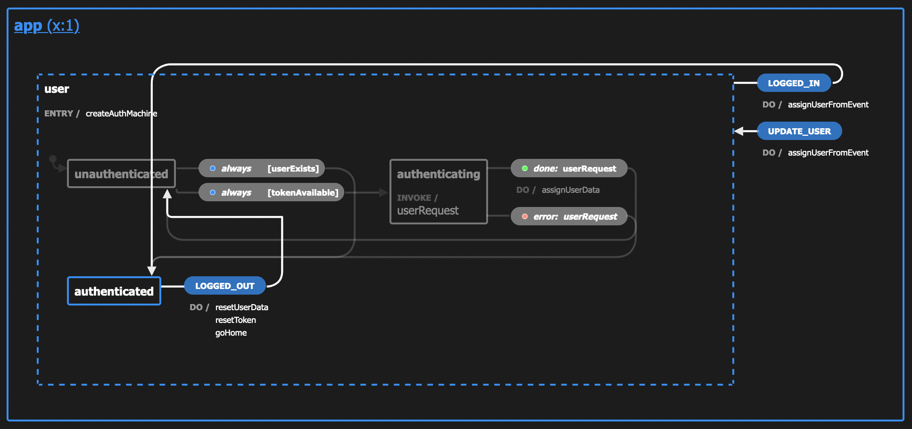
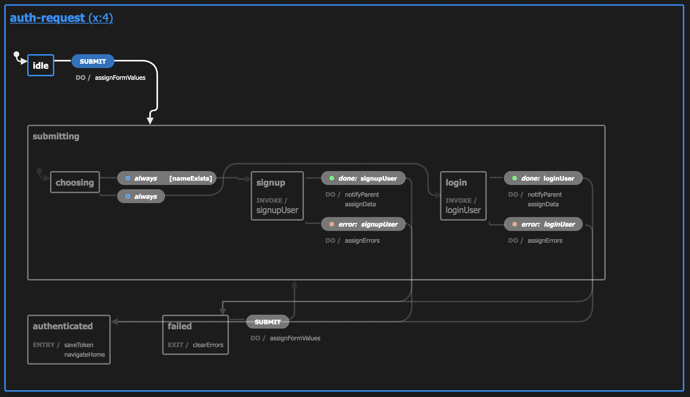
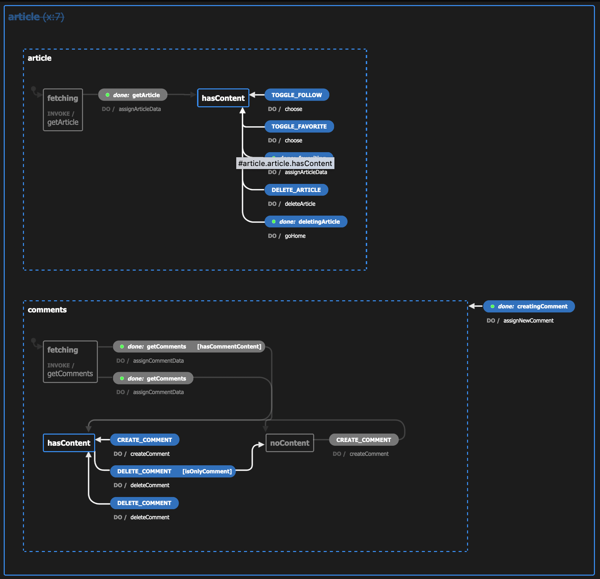
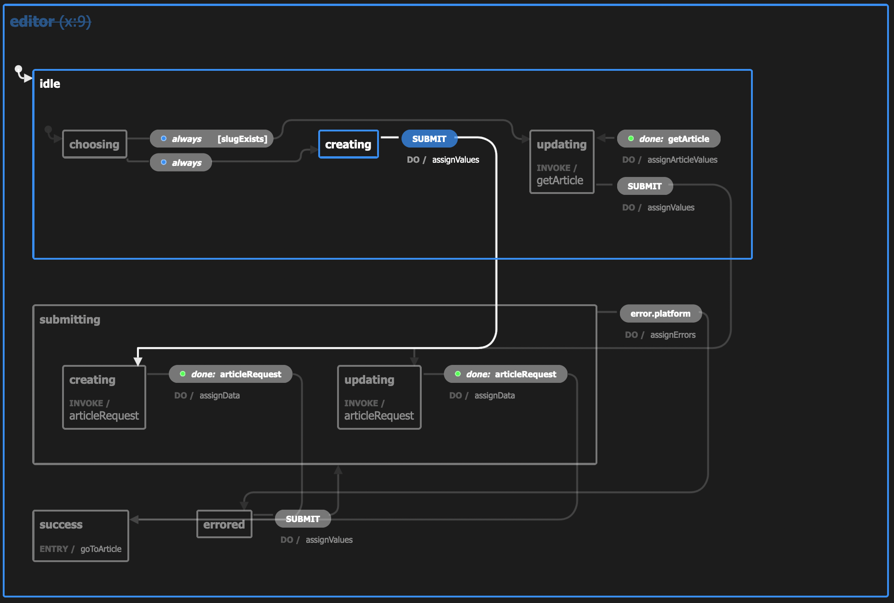
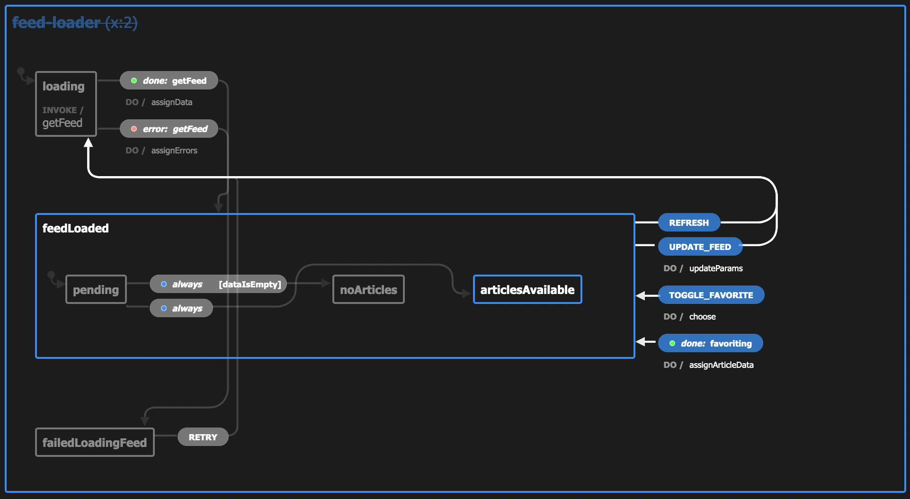
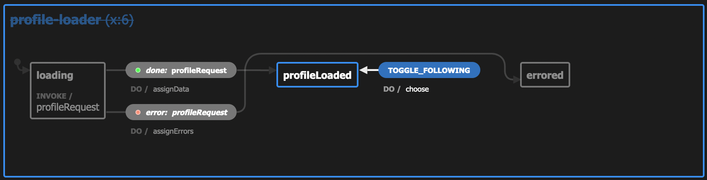
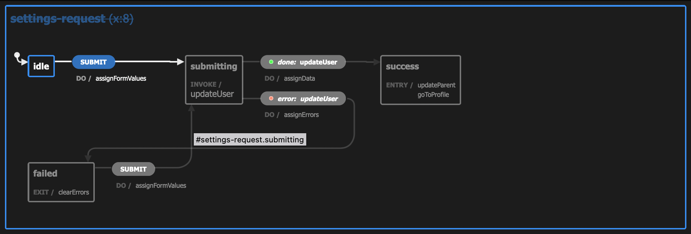

# 

> ### XState + React codebase containing real world examples (CRUD, auth, advanced patterns, etc) that adheres to the [RealWorld](https://github.com/gothinkster/realworld) spec and API.

### [Demo](https://github.com/gothinkster/realworld)&nbsp;&nbsp;&nbsp;&nbsp;[RealWorld](https://github.com/gothinkster/realworld)

This codebase was created to demonstrate a fully fledged fullstack application built with **XState & React** including CRUD operations, authentication, routing, pagination, and more.

We've gone to great lengths to adhere to the **XState & React** community styleguides & best practices.

For more information on how to this works with other frontends/backends, head over to the [RealWorld](https://github.com/gothinkster/realworld) repo.

# How it works

> Describe the general architecture of your app here

App machine:

Auth machine:

Article machine:

Editor machine:

Feed machine:

Profile machine:

Settings machine:

# Getting started

1. `npm install`
2. `npm start`
